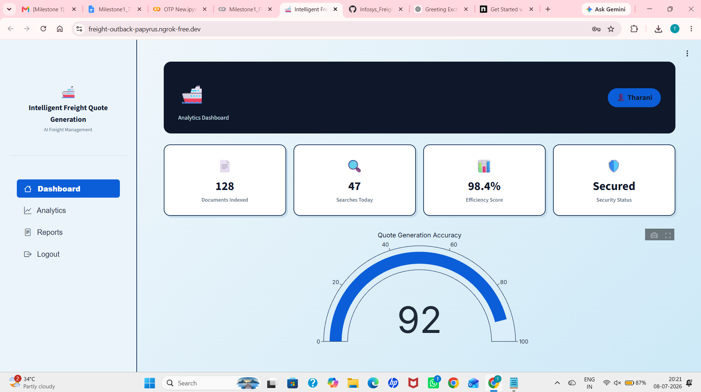

# 🚢 Intelligent Freight Quote Generation

An AI-powered freight quotation platform designed to simplify and secure the freight quotation process through intelligent authentication, user management, and secure access control.

This project was developed as part of the **Infosys Springboard Internship – Milestone 1** to demonstrate secure authentication, role-based access, and modern web application development using Python and Streamlit.

---

# 📌 About the Project

Freight quotation is one of the most important processes in the logistics and shipping industry. Before any shipment is booked, brokers and customers need to exchange freight quotations securely.

This project focuses on building the authentication module of an Intelligent Freight Quote Generation platform.

The application provides a secure environment where users can register, authenticate themselves, recover forgotten passwords, and access their personalized dashboard. A dedicated administrator dashboard enables monitoring of registered users while maintaining complete password security.

The system has been designed with scalability in mind so that AI-based freight quotation modules can be integrated in future milestones.

---

# 🎯 Problem Statement

Traditional freight management systems often suffer from

- Weak authentication mechanisms
- Insecure password storage
- Poor user management
- Lack of secure password recovery
- No role-based access control

This project addresses these issues by implementing a secure authentication system using industry-standard security practices.

---

# 🚀 Features

### User Authentication

- User Registration
- Secure Login
- Logout
- JWT Session Authentication

### Password Security

- Password Hashing using bcrypt
- Strong Password Validation
- Confirm Password Validation

### Password Recovery

- Security Question Verification
- Email OTP Verification
- Password Reset

### User Dashboard

- Personalized Dashboard
- Freight Analytics Overview
- System Status Indicators

### Administrator Dashboard

- Dedicated Admin Login
- View Registered Users
- Monitor User Accounts
- Secure Access Control

---

# 🔒 Security Implementation

Security is one of the core objectives of this project.

The following security mechanisms have been implemented:

- bcrypt Password Hashing
- JWT Authentication
- Email OTP Verification
- Security Question Verification
- SQLite Secure Storage
- Environment Variables using Google Colab Secrets
- Hidden Credentials
- Passwords Never Stored in Plain Text

---

# 🛠 Technology Stack

| Technology | Purpose |
|------------|---------|
| Python | Backend |
| Streamlit | Web Application |
| SQLite | Database |
| JWT | Authentication |
| bcrypt | Password Encryption |
| Gmail SMTP | OTP Service |
| Plotly | Dashboard Visualization |
| Pyngrok | Public Deployment |

---
# 🛠 Technologies Used

The project was developed using the following technologies and libraries:

- **Python** – Backend programming language
- **Streamlit** – Web application framework
- **SQLite** – Database for storing user information
- **bcrypt** – Password hashing and encryption
- **JWT (JSON Web Token)** – Secure user session management
- **SMTP (Gmail)** – Sending OTP emails for password recovery
- **Pyngrok** – Creating a public URL for accessing the Streamlit application
- **Plotly** – Interactive dashboard visualization
- **Google Colab** – Development and execution environment
- **Google Colab Secrets** – Secure storage of sensitive credentials

---

# ⚙️ Project Implementation

## Install Required Libraries

The required Python libraries were installed using pip, including Streamlit, bcrypt, JWT, Plotly, and Pyngrok.

---

## Configure the Application

The application was created using Streamlit with a responsive user interface. A custom color theme and styling were applied to provide a professional appearance suitable for a freight management platform.

---

## Google Colab Secrets

Sensitive information was stored using Google Colab Secrets, including:

- EMAIL_ADDRESS
- EMAIL_PASSWORD
- JWT_SECRET
- NGROK_AUTHTOKEN
- ADMIN_PASSWORD

This prevents sensitive credentials from being hardcoded in the source code.

---
## Ngrok Authentication and Deployment

To make the Streamlit application accessible over the internet, **Pyngrok** was used to create a secure public URL. The following steps were performed:

1. Created an account on the **ngrok** website and generated an **authentication token**.
2. Opened the **Google Colab Secrets** panel.
3. Added a new secret with the name **NGROK_AUTHTOKEN**.
4. Enabled notebook access for the secret.
5. Retrieved the authentication token securely using `userdata.get("NGROK_AUTHTOKEN")`.
6. Configured Pyngrok by calling `ngrok.set_auth_token()` with the retrieved token.
7. Stopped any previously running Streamlit processes to avoid port conflicts.
8. Started the Streamlit application on port **8501** using the `subprocess` module.
9. Created a secure public tunnel using `ngrok.connect(8501)`.
10. Displayed the generated public URL, allowing the application to be accessed from any browser for testing and demonstration.
11. After testing was completed, the Streamlit process and ngrok tunnel were terminated to release system resources.

# 📂 Project Workflow

User Registration

↓

Input Validation

↓

Password Encryption

↓

Database Storage

↓

Secure Login

↓

JWT Authentication

↓

User Dashboard

↓

Password Recovery (Security Question / OTP)

↓

Password Reset

↓

Administrator Monitoring

---

## Login Page

The login page allows registered users to securely access the Intelligent Freight Quote Generation platform using their email address and password.

---

## Registration Page

The registration page enables new users to create an account by providing their username, email address, password, security question, and security answer. The application validates all required fields, verifies the email format, checks password strength, and securely stores the encrypted user credentials in the database.

---

## Forgot Password

The Forgot Password module allows users to recover their account securely through two verification methods.

---

## Security Question Verification

Users can reset their password by answering the security question selected during registration.

---

## OTP Verification

A six-digit One-Time Password (OTP) is generated and sent to the user's registered email address for secure password recovery.

---

## User Dashboard

After successful login, users are redirected to the Freight Operations Dashboard where they can access system information and analytics.

---

## Admin Dashboard

The administrator dashboard provides access to registered user information and administrative controls while maintaining password security.

# 📈 Future Enhancements

This authentication system serves as the foundation for future milestones.

Upcoming modules include:

- AI Freight Quote Prediction
- Freight Cost Optimization
- Shipment Tracking
- Customer Management
- Quote History
- AI Recommendation Engine
- Maritime Analytics Dashboard

neration
