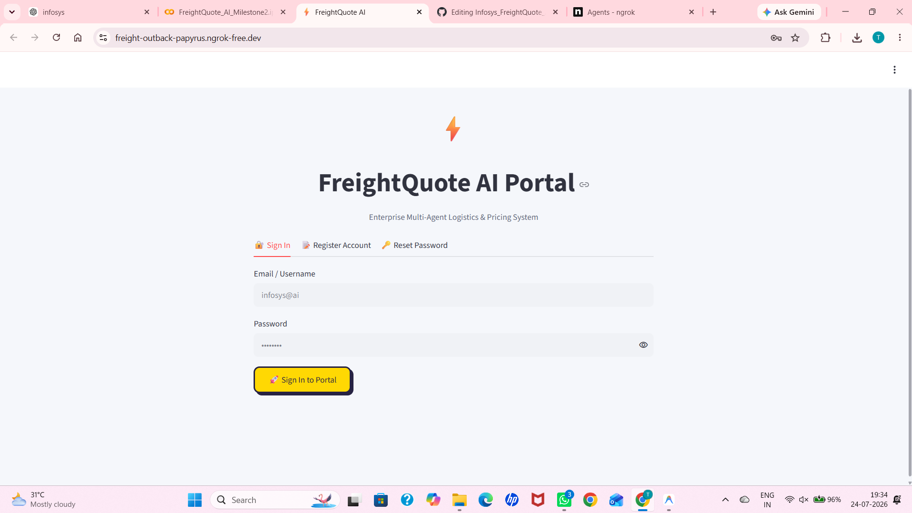
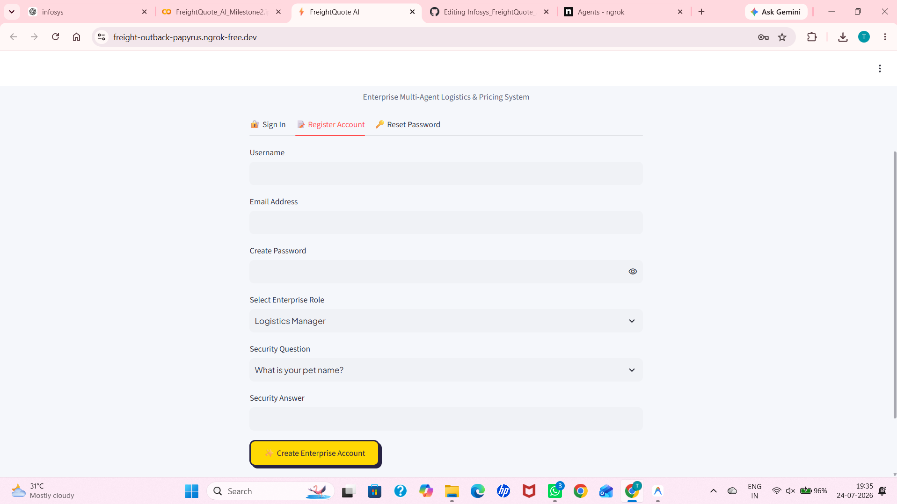
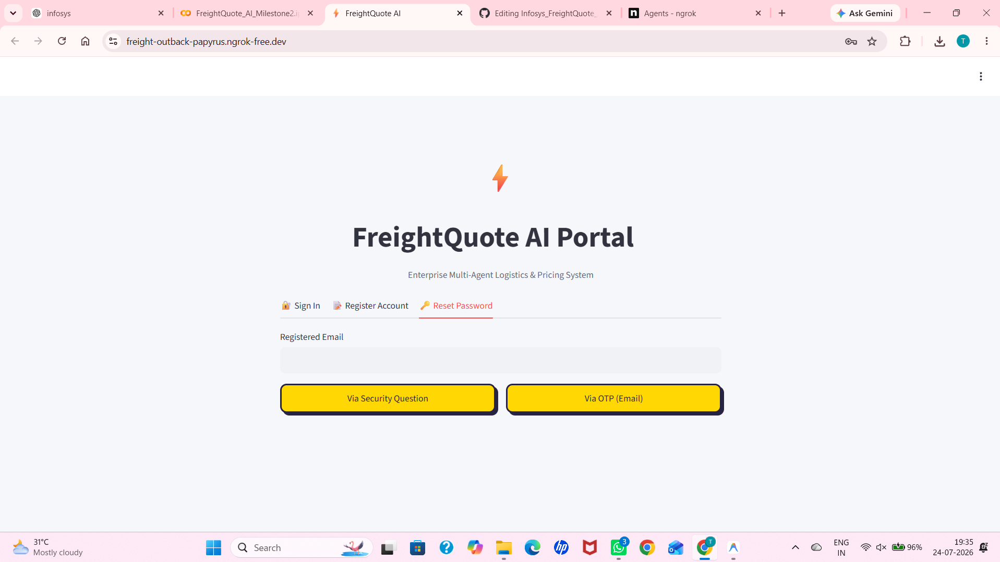
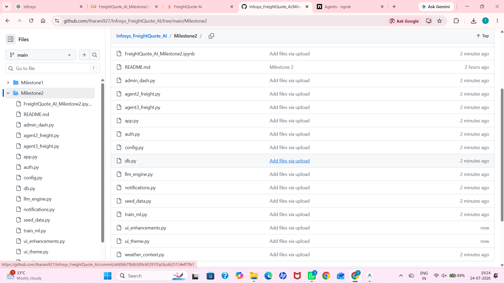
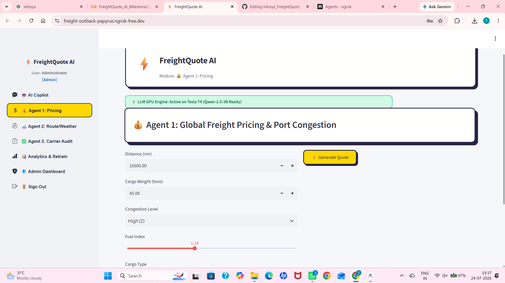
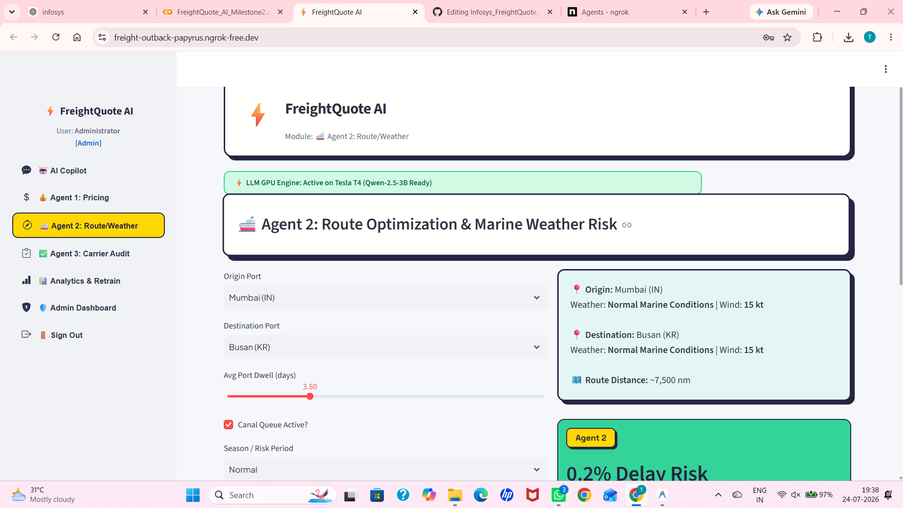
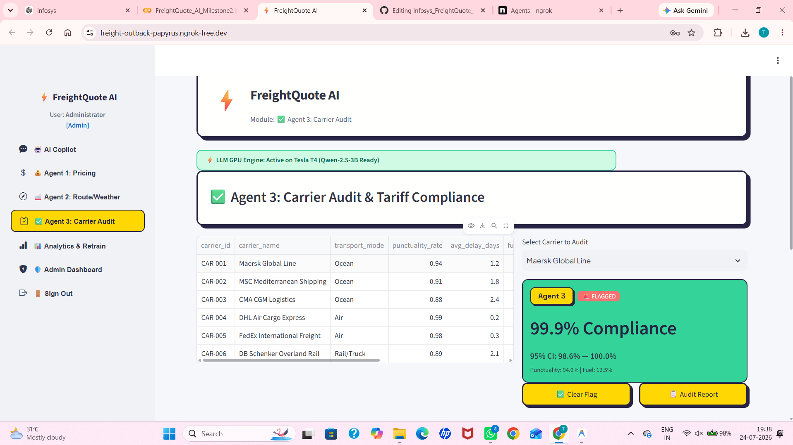
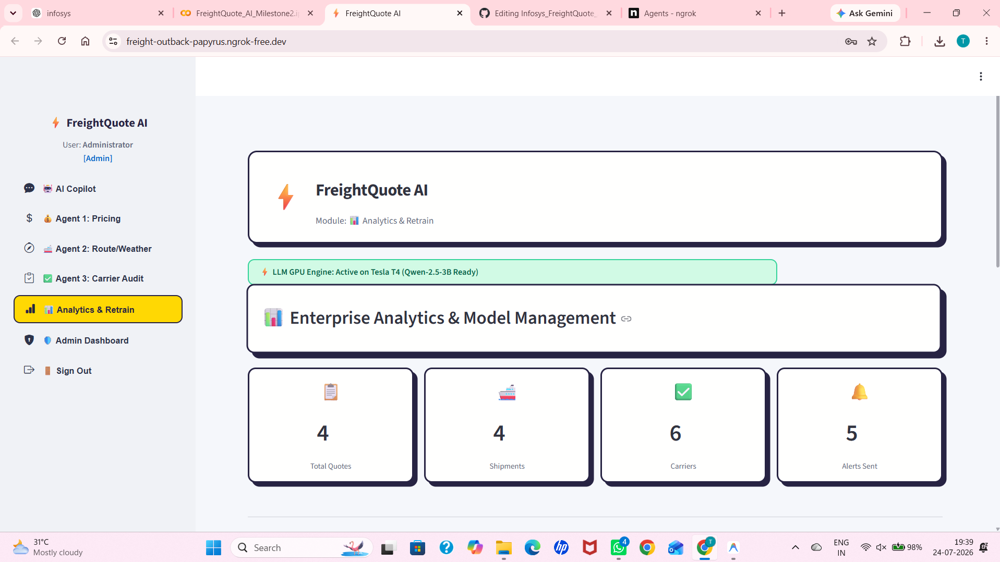
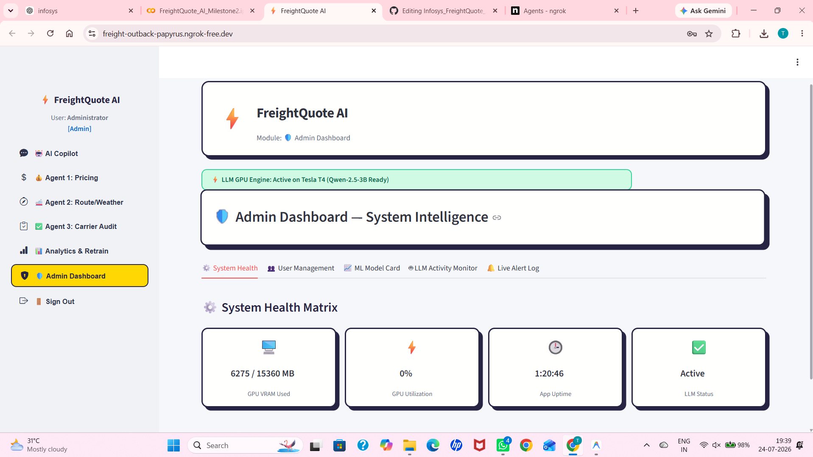

# 🚢 FreightQuote AI
## Intelligent Maritime Brokerage Platform

### Infosys Springboard Internship – Milestone 2

---

# 📖 Project Overview

FreightQuote AI is an AI-powered maritime logistics platform developed as part of the Infosys Springboard Internship. The application combines Secure Authentication, Artificial Intelligence, Machine Learning, and Data Analytics to automate freight quotation generation and logistics decision-making.

The project enables users to estimate freight costs, analyze shipping routes, evaluate carrier performance, and receive intelligent recommendations through an AI-powered logistics assistant. The platform is developed using Streamlit, SQLite, Hugging Face Large Language Models, and Machine Learning models trained on Kaggle datasets.

---

# 🎯 Project Objectives

- Develop a secure logistics web application.
- Implement JWT-based user authentication.
- Integrate Hugging Face AI Copilot.
- Train Machine Learning models using Kaggle datasets.
- Predict freight pricing.
- Analyze shipping routes and weather.
- Evaluate carrier compliance.
- Build an Admin Dashboard for monitoring and management.

---

# 🛠 Technologies Used

- Python
- Streamlit
- SQLite
- Pandas
- NumPy
- Scikit-Learn
- Hugging Face Transformers
- Kaggle API
- JWT
- Bcrypt
- Google Colab
- ngrok

---

# 🔐 Sign In Page

The Sign In page provides secure authentication for registered users. Users can log in using their email and password. JWT authentication validates user credentials and grants secure access to the application.

### Features

- Secure Login
- JWT Authentication
- Password Encryption
- Progressive Account Lock
- Secure User Session



---

# 📝 Register Page

The Register Page allows new users to create an account securely. Password strength validation ensures that users create strong passwords before registration.

### Features

- New User Registration
- Password Strength Checker
- Email Validation
- Password Hashing using Bcrypt
- Secure User Creation



---

# 🔑 Reset Password Page

The Reset Password module enables users to securely recover their accounts using OTP verification and password reset functionality.

### Features

- Forgot Password
- OTP Verification
- Password Reset
- OTP Cooldown
- Secure Password Update



---

# 🤖 AI Copilot

The AI Copilot is powered by the Hugging Face Qwen 2.5 3B Instruct Large Language Model. It assists users by answering logistics-related questions and providing intelligent shipping recommendations.

### Features

- Hugging Face Integration
- AI Chat Assistant
- Logistics Guidance
- Freight Recommendations
- Shipping Suggestions
- Natural Language Interaction



---

# 💬 AI Copilot Response

After receiving user queries, the AI Copilot generates intelligent responses using the Hugging Face Large Language Model. It provides practical logistics advice, shipment recommendations, and route guidance.

### Features

- Intelligent AI Responses
- Context-Based Suggestions
- Logistics Assistance
- Interactive Conversation

.png)

---

# 💰 Pricing Page

The Pricing Page predicts estimated freight costs based on shipment information entered by the user. The prediction is generated using trained Machine Learning models.

### Features

- Freight Cost Prediction
- Shipment Cost Estimation
- Machine Learning Prediction
- Fast Processing
- Champion Model Selection



---

# 🌦 Route & Weather Page

The Route & Weather module analyzes transportation routes together with weather conditions to recommend safe and efficient shipment routes.

### Features

- Route Analysis
- Weather Analysis
- Route Optimization
- Risk Identification
- Shipment Recommendations



---

# 🚢 Carrier Audit Page

The Carrier Audit module evaluates carrier performance and predicts carrier compliance using trained Machine Learning models. It assists users in selecting reliable logistics partners.

### Features

- Carrier Performance Analysis
- Compliance Prediction
- Risk Assessment
- Carrier Rating
- Audit Summary



---

# 📊 Analytics Dashboard

The Analytics Dashboard provides visual insights into prediction statistics and machine learning performance using interactive charts and summaries.

### Features

- Prediction Statistics
- Interactive Charts
- Model Performance
- Shipment Analytics
- Dashboard Visualization



---

# 👨‍💼 Admin Dashboard

The Admin Dashboard provides centralized administration and monitoring capabilities. Administrators can manage users, monitor activity, and review system performance.

### Features

- User Management
- Account Monitoring
- Unlock Locked Accounts
- Administrative Controls
- System Monitoring
- Dashboard Overview



---

# 🤖 Machine Learning

Multiple Machine Learning algorithms were trained using logistics datasets downloaded through the Kaggle API.

### Algorithms Used

- Random Forest
- Gradient Boosting
- Extra Trees
- Decision Tree
- Logistic Regression
- Ridge Regression
- AdaBoost
- K-Nearest Neighbors (KNN)
- Support Vector Machine (SVM)
- Multi Layer Perceptron (MLP)

The system compares all trained models and automatically selects the Champion Model based on prediction performance.

---

# 📦 Kaggle Dataset Integration

The project uses Kaggle datasets to train Machine Learning models for freight prediction, route analysis, and carrier audit.

### Implementation

- Created Kaggle Account
- Generated Kaggle API Credentials
- Stored Credentials in Google Colab Secrets
- Downloaded Logistics Datasets
- Data Preprocessing
- Feature Engineering
- Model Training
- Champion Model Selection

---

# 🤖 Hugging Face Integration

The AI Copilot is integrated with the Hugging Face Qwen 2.5 3B Instruct model.

### Implementation

- Created Hugging Face Account
- Generated API Token
- Stored Token in Google Colab Secrets
- Connected AI Copilot
- Generated Intelligent Responses

---

# 🔒 Security Features

The application follows secure software engineering practices.

### Implemented Security Features

- JWT Authentication
- Password Hashing using Bcrypt
- Password Strength Validation
- OTP Verification
- Progressive Account Lock
- Secure Session Management
- Role-Based Authentication

---

# 🚀 Deployment

The application was developed and tested using Google Colab. Streamlit was used to create the web interface, and ngrok generated a secure public URL for accessing the application through a web browser.

---

# 📁 Project Structure

```
FreightQuote_AI/
│
├── app.py
├── auth.py
├── admin_dash.py
├── db.py
├── config.py
├── llm_engine.py
├── notifications.py
├── seed_data.py
├── train_ml.py
├── ui_theme.py
├── weather_context.py
├── agent2_freight.py
├── agent3_freight.py
├── requirements.txt
├── README.md
├── signin page.png
├── register page.png
├── reset password page.png
├── ai copilot page.png
├── ai copilot page (2).png
├── pricing page.png
├── routeweather page.png
├── carrier audit page.png
├── analytics page.png
└── admin dashboard page.png
```

---

# ✅ Conclusion

FreightQuote AI successfully integrates Secure Authentication, Artificial Intelligence, Machine Learning, and Data Analytics into a single enterprise-level logistics platform. The project demonstrates practical implementation of secure software engineering principles, predictive analytics, intelligent decision support, and modern web application development, making it a comprehensive solution for freight quotation and logistics management.
