# 🚢 FreightQuote AI
## Intelligent Maritime Brokerage Platform
### Infosys Springboard Internship – Milestone 2

---

# 📖 Project Overview

FreightQuote AI is an AI-powered maritime logistics platform developed as part of the Infosys Springboard Internship Program. The objective of this project is to simplify freight quotation generation and logistics decision-making using Artificial Intelligence, Machine Learning, and Secure Authentication.

The application enables users to estimate freight pricing, analyze shipping routes and weather conditions, evaluate carrier compliance, and interact with an AI-powered logistics assistant. The platform is built using Streamlit and follows a modular architecture with separate Python modules for authentication, AI integration, machine learning, analytics, and administration.

---

# 🎯 Project Objectives

- Develop a secure logistics web application.
- Implement user authentication using JWT.
- Integrate AI-powered logistics assistance.
- Train multiple Machine Learning models.
- Predict freight pricing.
- Analyze shipping routes.
- Evaluate carrier compliance.
- Build an enterprise Admin Dashboard.

---

# 🛠 Technology Stack

### Programming Language

- Python

### Frontend

- Streamlit

### Database

- SQLite

### Machine Learning

- Scikit-Learn
- Pandas
- NumPy
- Joblib

### Artificial Intelligence

- Hugging Face Transformers
- Qwen 2.5 3B Instruct Model

### APIs

- Hugging Face API
- Kaggle API
- ngrok

### Security

- JWT Authentication
- Password Hashing (Bcrypt)
- OTP Verification

---

# 🔐 Sign In Page

The Sign In page provides secure authentication for registered users. JWT authentication validates the credentials and allows authorized users to access the FreightQuote AI platform.

### Features

- Secure Login
- JWT Authentication
- Password Encryption
- Session Management
- Progressive Account Lock

The Login Page provides a secure entry point for registered users to access the FreightQuote AI Portal. Users authenticate using their registered email or username and password. The system validates credentials, manages user sessions using JWT authentication, and protects accounts with progressive lockout mechanisms after multiple failed login attempts.

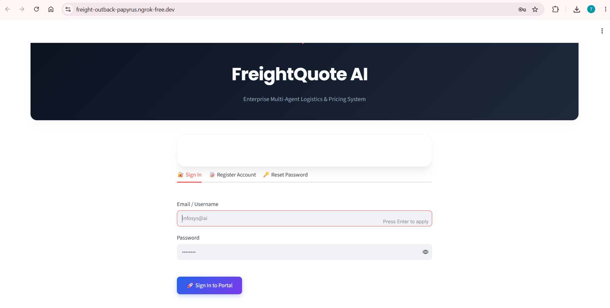

---

# 📝 Register Page

The Register page enables new users to create an account securely. Password strength validation ensures users choose strong passwords, while passwords are stored securely using Bcrypt hashing.

### Features

- User Registration
- Password Strength Validation
- Email Validation
- Secure Password Hashing
- Duplicate User Prevention

The Register Page allows new users to create an account by entering their personal information, selecting a role, and setting a secure password. The application performs password strength validation, prevents duplicate registrations, and securely stores user credentials using Bcrypt password hashing.

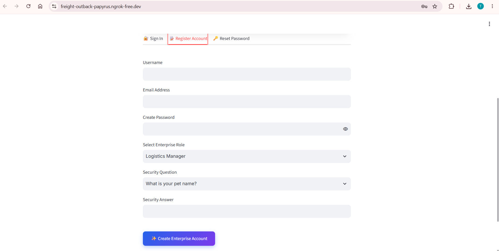

---

# 🔑 Reset Password Page

Users who forget their password can securely reset it using OTP verification. This feature ensures account recovery while maintaining application security.

### Features

- Forgot Password
- OTP Verification
- Password Reset
- Secure Password Update
- OTP Cooldown

The Reset Password page enables users to recover access to their accounts securely using OTP verification or a security question. A one-time password is sent to the registered email address, allowing users to verify their identity and create a new password while maintaining account security.

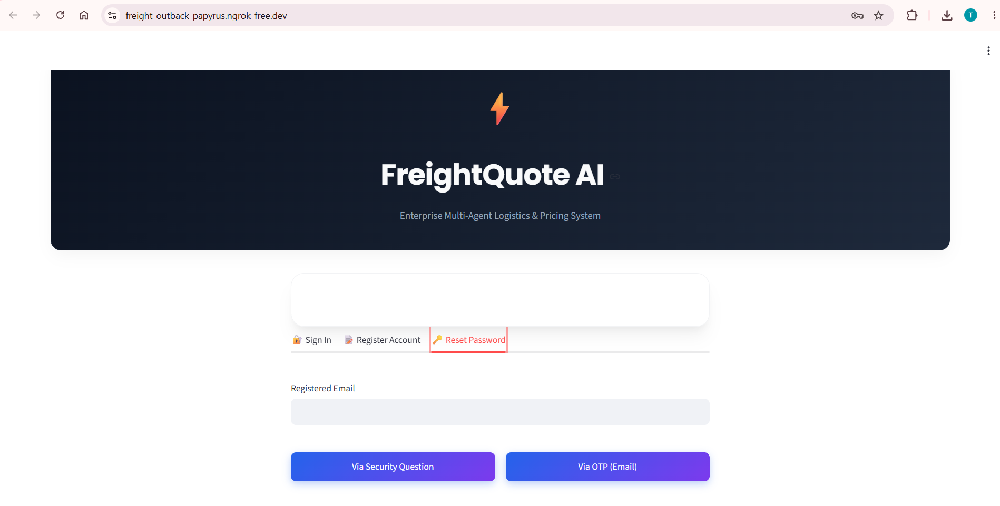
---

# 🤖 AI Copilot

The AI Copilot is powered by the Hugging Face Qwen 2.5 3B Instruct Large Language Model. It assists users by answering freight and logistics-related questions using natural language.

### Features

- AI Chat Assistant
- Freight Guidance
- Logistics Recommendations
- Natural Language Interaction
- Hugging Face Integration

---

## AI Copilot – Home

This page serves as the entry point to the AI Copilot. Users can access the AI assistant, explore its capabilities, and begin interacting with the logistics chatbot through a simple and intuitive interface.

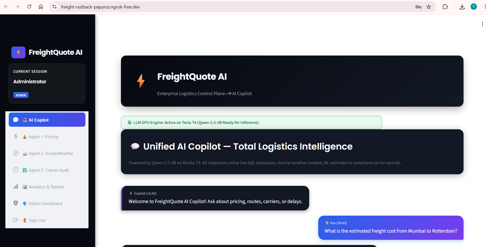

---

## AI Copilot – Chat Interface

This page displays the conversational interface where users can ask freight and logistics-related questions. The AI Copilot processes the user's query, generates intelligent responses, and provides recommendations based on the context, making logistics planning more efficient and interactive.

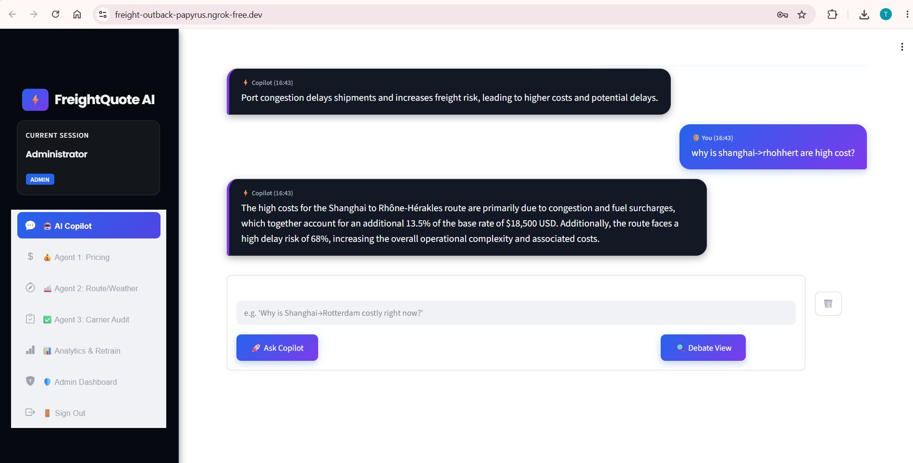

---

# 💰 Freight Pricing

The Freight Pricing module uses Machine Learning to estimate the shipping cost based on various shipment parameters such as cargo weight, shipping distance, port congestion, fuel index, and delivery requirements. By leveraging trained predictive models, the system generates accurate freight cost estimates to support logistics planning and decision-making.

---

## Freight Pricing Dashboard

This page allows users to enter shipment details and receive an estimated freight cost instantly. The prediction is generated using the best-performing Machine Learning model selected during the training process. The dashboard provides users with a fast and reliable way to estimate transportation costs before shipment.

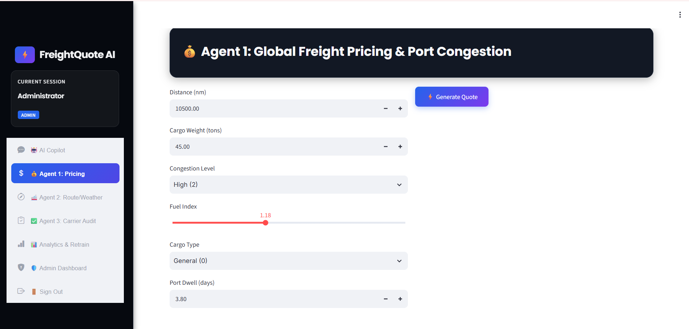

---

# 🌦 Route & Weather Analysis

The Route & Weather Analysis module helps users identify the most efficient shipping route by analyzing distance, estimated travel time, weather conditions, and potential route risks. This feature assists logistics planners in selecting the safest and most reliable routes, reducing delays and improving shipment efficiency.

---

## Route & Weather Dashboard – Route Analysis

This page displays the optimal shipping route between the selected source and destination. It provides route information, estimated distance, travel time, and recommendations to help users choose the most efficient path for freight transportation.

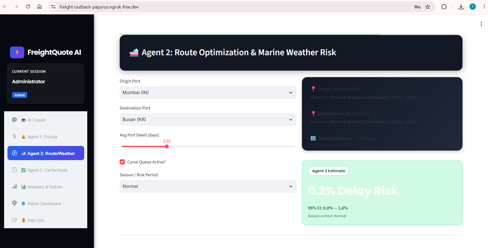

---

## Route & Weather Dashboard – Weather Analysis

This page presents weather conditions and environmental factors that may affect shipment delivery. It helps users identify possible weather-related risks and supports better logistics planning by recommending safer transportation schedules and routes.

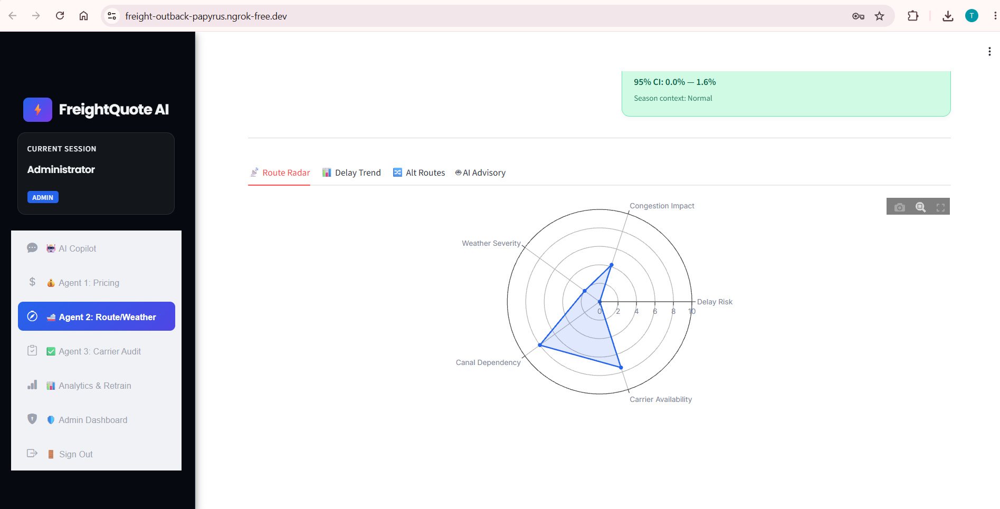

---

# 🚢 Carrier Audit

The Carrier Audit module evaluates the performance and compliance of logistics carriers using machine learning and predefined business rules. It helps organizations identify reliable carriers, assess operational risks, and make informed shipping decisions based on historical performance and compliance metrics.

---

## Carrier Audit Dashboard

This page displays a comprehensive audit of carriers, including compliance status, performance ratings, risk assessments, and operational insights. It enables users to evaluate carrier reliability and supports better logistics planning through data-driven analysis.

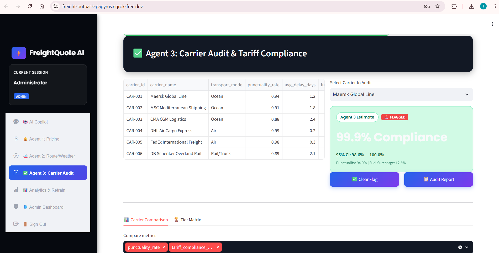

---

# 📊 Analytics Dashboard

The Analytics Dashboard provides valuable insights into freight operations, machine learning performance, and overall system activity. It helps administrators and logistics managers monitor trends, evaluate model performance, and make data-driven decisions using interactive visualizations.

---

## Analytics Dashboard – Overview

This page presents an overview of the analytics dashboard, displaying key metrics, freight statistics, and a summary of system performance.

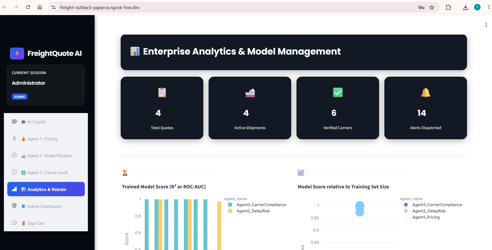

---

## Analytics Dashboard – Machine Learning Insights

This section displays machine learning performance metrics, prediction accuracy, model comparison results, and other analytical information that helps evaluate the effectiveness of the trained models.

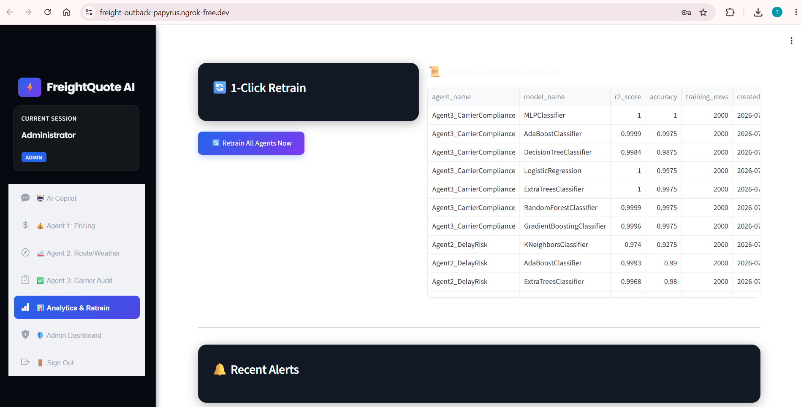

---

## Analytics Dashboard – Reports & Visualizations

This page contains interactive charts, graphical reports, and detailed visualizations of freight predictions, logistics trends, and overall application statistics to support informed decision-making.

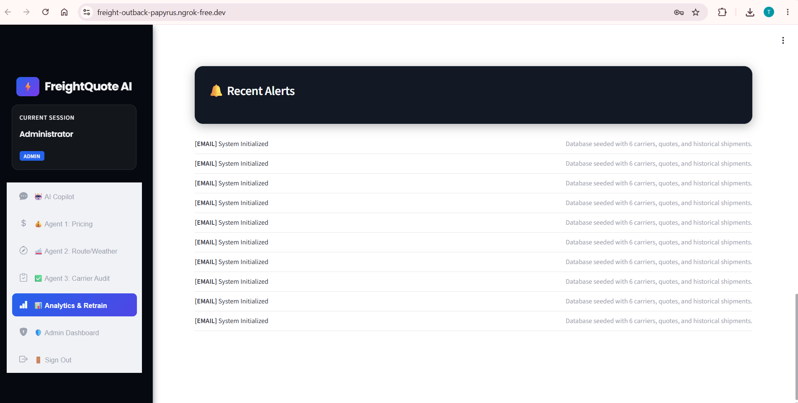

---

# 👨‍💼 Admin Dashboard

The Admin Dashboard provides administrators with complete control over the FreightQuote AI Portal. It allows administrators to monitor users, manage accounts, analyze system performance, and oversee machine learning activities through an interactive dashboard.

---

## Admin Dashboard – Overview

This page displays the overall system status, including key performance metrics and quick access to administrative features.

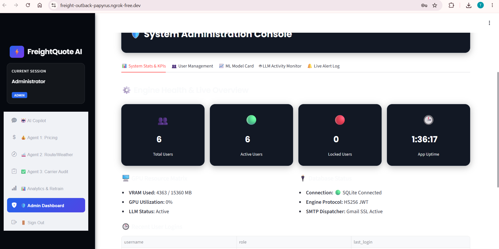

---

## Admin Dashboard – User Management

Administrators can view all registered users, manage user accounts, unlock locked accounts, and perform administrative actions.

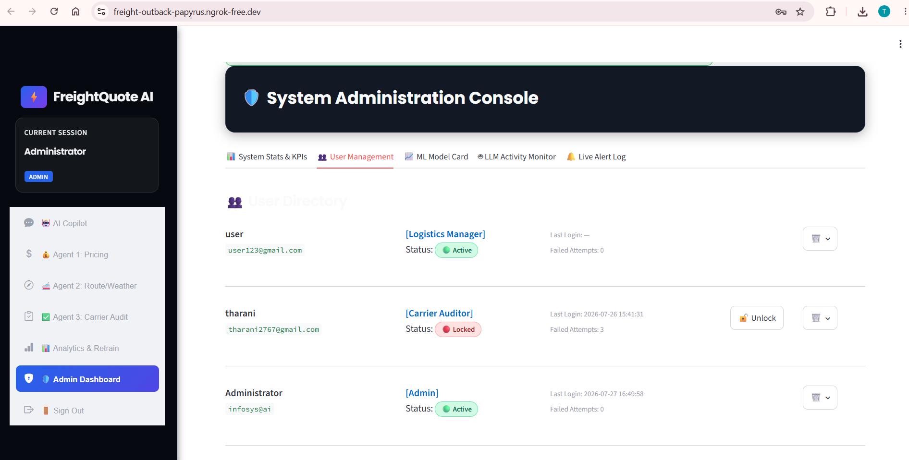

---

## Admin Dashboard – Analytics

This section provides analytical insights into system usage, user activities, and freight-related statistics through interactive charts.

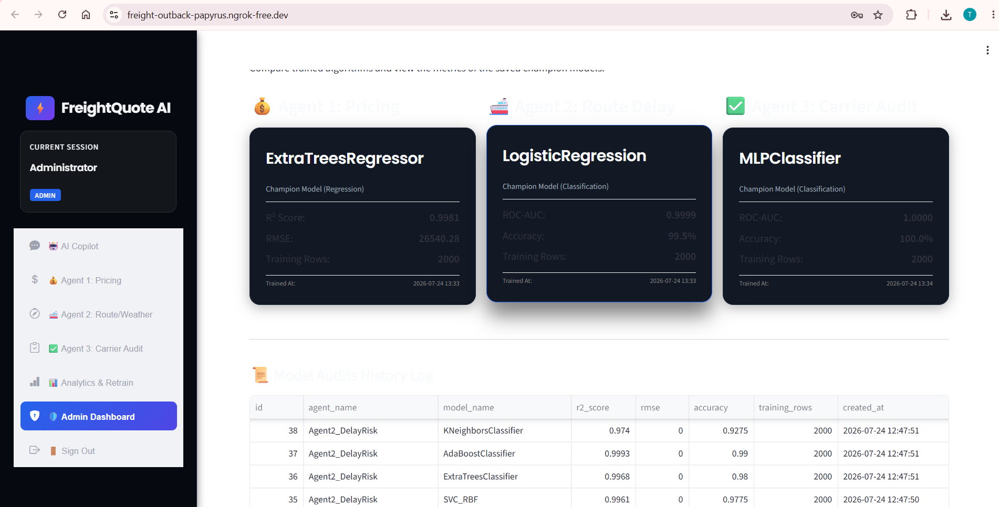

---

## Admin Dashboard – System Monitoring

Displays real-time monitoring information, system health, machine learning model status, and operational metrics.

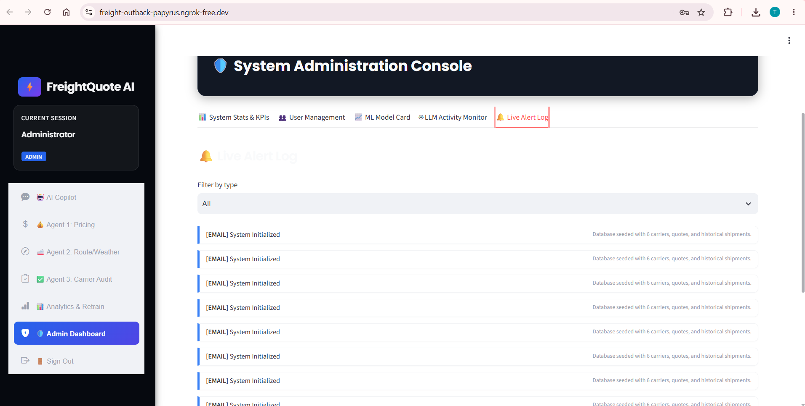

---

## Admin Dashboard – Activity Logs

Shows detailed system logs, recent administrative actions, and application events for monitoring and auditing purposes.

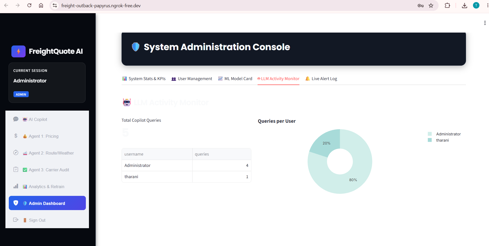

# 🤖 Machine Learning Implementation

The project trains multiple Machine Learning models using logistics datasets downloaded through the Kaggle API.

### Algorithms Used

- Random Forest
- Gradient Boosting
- Extra Trees
- Decision Tree
- Logistic Regression
- Ridge Regression
- AdaBoost
- K-Nearest Neighbors (KNN)
- Support Vector Machine (SVM)
- Multi Layer Perceptron (MLP)

The application compares all trained models and automatically selects the Champion Model for making predictions.

---

# 📦 Kaggle Integration

The project uses Kaggle datasets for training Machine Learning models.

### Implementation Steps

- Created Kaggle Account
- Generated Kaggle API Credentials
- Stored Credentials securely in Google Colab Secrets
- Downloaded Logistics Datasets
- Data Preprocessing
- Machine Learning Training
- Champion Model Selection

---

# 🤖 Hugging Face Integration

The AI Copilot uses the Hugging Face Qwen 2.5 3B Instruct model.

### Implementation Steps

- Created Hugging Face Account
- Generated API Token
- Stored API Token in Google Colab Secrets
- Connected AI Copilot
- Generated Intelligent Responses

---

# 🔒 Security Features

The application follows modern secure software engineering practices.

### Implemented Features

- JWT Authentication
- Password Hashing using Bcrypt
- Password Strength Checker
- OTP Verification
- Progressive Account Lockout
- Secure Session Management
- Role-Based Authentication

---

# 🚀 Deployment

The application was developed and executed using Google Colab. Streamlit was used to build the user interface, and ngrok generated a secure public URL for remote access.

---

# 📁 Project Structure

```
FreightQuote_AI/
│
├── app.py
├── auth.py
├── admin_dash.py
├── db.py
├── config.py
├── llm_engine.py
├── notifications.py
├── seed_data.py
├── train_ml.py
├── ui_theme.py
├── weather_context.py
├── agent2_freight.py
├── agent3_freight.py
├── requirements.txt
├── README.md
└── Project Screenshots
```

---

# 🎯 Future Enhancements

- Live Weather API Integration
- Real-Time Vessel Tracking
- PDF Freight Quote Generation
- Email Notification System
- Docker Deployment
- Cloud Deployment (Azure/AWS)

---

# ✅ Conclusion

FreightQuote AI successfully integrates Secure Authentication, Artificial Intelligence, Machine Learning, and Interactive Dashboards into a single enterprise-level logistics platform. The project demonstrates secure software engineering principles, predictive analytics, AI-assisted decision-making, and modern web application development for intelligent freight management.
