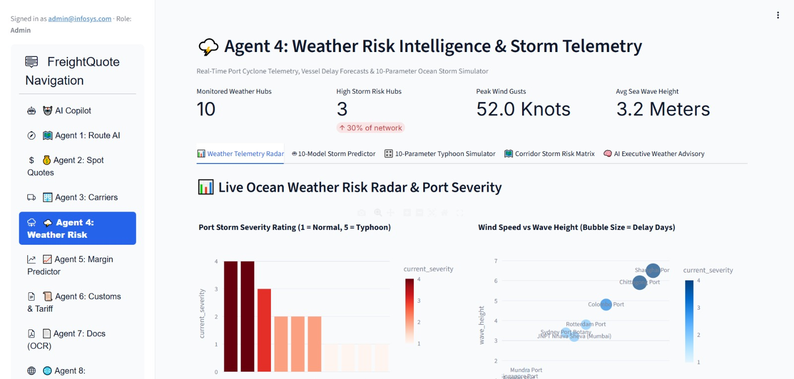
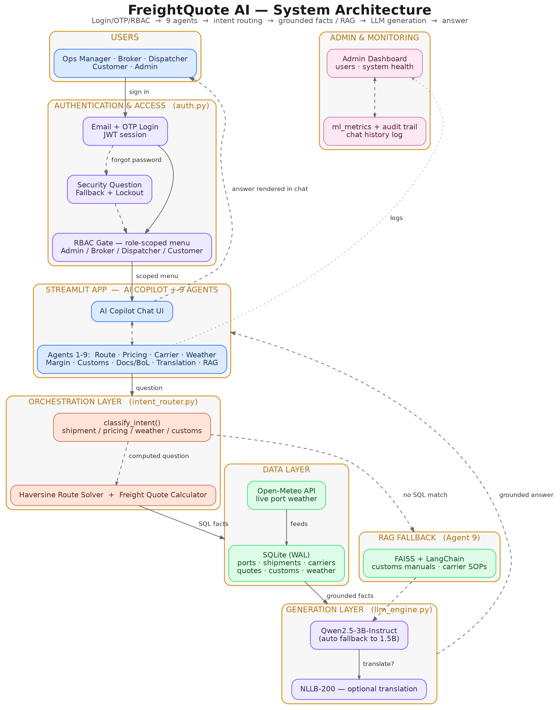
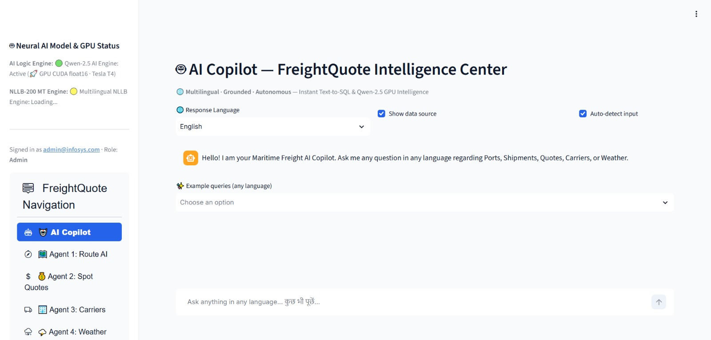

<div align="center">

# 🚢 FreightQuote AI

### **MARITIME FREIGHT INTELLIGENCE, BUILT AS A TEAM OF SPECIALISED AGENTS**

<p>
  <strong>Price smarter · Route better · Understand risk · Work with documents</strong>
</p>

<br>

| 🤖 AGENTIC AI | 🧠 GROUNDED COPILOT | 📊 ML INTELLIGENCE | 📚 RAG |
|:---:|:---:|:---:|:---:|
| **9 Agents** | **Evidence-first answers** | **Prediction & analysis** | **PDF knowledge retrieval** |

<br>


</div>

---

## 🌊 What is FreightQuote AI?

**FreightQuote AI** is an agentic decision-support platform for maritime freight operations.

Instead of making users move between separate tools for pricing, routing, weather, carriers, customs and documents, the platform brings these capabilities together through **nine specialised agents**, a **grounded AI Copilot**, machine-learning models and document retrieval.

> **One platform. Multiple freight-intelligence capabilities. Grounded decisions.**

---

## ⚡ Platform at a Glance

| Capability | What the platform provides |
|---|---|
| 💰 **Pricing** | Freight quote prediction, rate analysis and margin intelligence |
| 🗺️ **Routing** | Route optimisation and port/congestion intelligence |
| 🚢 **Carrier Intelligence** | Carrier reliability, safety and capacity analysis |
| 🌦️ **Weather Risk** | Weather and harbour-risk assessment |
| 📈 **Margin Optimisation** | Cost, revenue and profit-margin analysis |
| 📜 **Customs & HS Codes** | Customs, tariff and compliance decision support |
| 📄 **Shipping Documents** | Quote and Bill of Lading document processing |
| 🌐 **Translation** | Multilingual maritime document and SOP translation |
| 📚 **Document RAG** | Question answering from uploaded PDF knowledge |

---

# 👥 Team FreightQuote AI

**Infosys Springboard Internship — Batch 1**

| # | Team Member | Primary Contribution |
|:---:|---|---|
| **01** | **Tharani Mahasamudram** | Agent validation and testing, verification of agent functionality and error-free execution, architecture/PPT support and quality checking |
| **02** | **Samathasri Kamireddy** | Project development, presentation/PPT support and integration activities |
| **03** | **Kavya Shree** | Project development and integrated platform contribution |
| **04** | **Yuvanesh V** | Project development, platform integration and documentation support |
| **05** | **Sravya Nanda** | Project development and integrated platform contribution |
| **06** | **Sai Laghuvar** | Project development and integrated platform contribution |

> FreightQuote AI was developed collaboratively, with the team contributing across development, validation, integration, documentation and presentation.

---

# 🎯 Why We Built It

Maritime freight decisions depend on several connected factors: **price, route, carrier, weather, margin, customs and documentation**.

When these are handled through separate sources, decision-making becomes slower and information can be difficult to connect.

### Our approach

**Bring the information together → let specialised agents handle specific tasks → ground responses in application data → present the result through one platform.**

---

# 🧩 The 9-Agent Intelligence Grid

Instead of treating the agents as one large system, FreightQuote AI separates freight operations into focused intelligence areas.

### 🟢 01 — PORT & ROUTE INTELLIGENCE
`Routing • Congestion • Port intelligence`

Optimises maritime routes and considers port/congestion information.

### 🟡 02 — DYNAMIC FREIGHT PRICING
`Quotes • Rates • Pricing analysis`

Supports freight quote prediction and pricing decisions.

### 🔴 03 — CARRIER PERFORMANCE & SAFETY
`Reliability • Capacity • Safety`

Provides carrier-performance and capacity intelligence.

### 🔵 04 — WEATHER RISK & HARBOR SAFETY
`Weather • Storms • Port risk`

Supports weather and harbour-risk assessment using live weather information.

### 🟣 05 — FREIGHT MARGIN OPTIMIZER
`Cost • Revenue • Profit margin`

Analyses freight profitability, cost and margin behaviour.

### 🟢 06 — CUSTOMS & HS CODE COMPLIANCE
`Customs • Tariffs • HS Codes`

Supports customs, tariff and regulatory decisions.

### 🟡 07 — QUOTE & BILL OF LADING DOCS
`Quotes • BoL • Shipping documents`

Processes shipping documents and supports quote/document generation.

### 🔴 08 — DOCUMENT & POLICY TRANSLATION
`Multilingual • Maritime • SOPs`

Provides multilingual translation for maritime documents and policies.

### 🔵 09 — CUSTOM PDF KNOWLEDGE BASE
`PDF • FAISS • RAG`

Retrieves relevant information from uploaded PDF documents and uses the retrieved evidence for answers.

---

## 🖼️ Agent Interface

<p align="center">
  
</p>

---

# 🏗️ How the Platform Works

The platform follows a layered flow from the user interface to authentication, agent orchestration, data/retrieval services and grounded generation.

<p align="center">
  
</p>

### Simplified execution path

```text
                 USER
                   │
                   ▼
          AUTHENTICATION + RBAC
                   │
                   ▼
         FREIGHTQUOTE AI PLATFORM
                   │
                   ▼
        MULTI-AGENT ORCHESTRATION
          ┌────────┼─────────┐
          ▼        ▼         ▼
        SQL      ML/API     RAG
          └────────┼─────────┘
                   ▼
             QWEN 2.5 LLM
                   │
                   ▼
          GROUNDED RESPONSE
```

---

# 🛠️ Technology Stack

| Layer | Technologies |
|---|---|
| 🎨 **UI** | Streamlit, Streamlit option menu |
| ⚙️ **Backend** | Python, FastAPI |
| 🧠 **LLM** | Qwen2.5-3B-Instruct |
| 🔎 **RAG** | FAISS, sentence-transformers |
| 🗃️ **Database** | SQLite |
| 📊 **ML** | scikit-learn |
| 🌦️ **Weather** | Open-Meteo REST API |
| 🗺️ **Visualisation** | Plotly, Folium, Streamlit-Folium |
| 🔐 **Security** | PyJWT, bcrypt |
| 🌐 **Translation** | NLLB-200 |
| 📄 **Reporting** | ReportLab / FPDF |
| ☁️ **Development** | Google Colab |
| 🔗 **Tunnelling** | ngrok / Cloudflare Tunnel |

---

# 🧠 AI Copilot — The Common Interface

The AI Copilot provides a single conversational entry point to the freight-intelligence platform.

### Answer pipeline

```text
Question
   ↓
Intent Classification
   ↓
Grounded Query / Tool Selection
   ↓
SQL / Agent / RAG Retrieval
   ↓
Qwen 2.5
   ↓
Grounded Answer
```

The Copilot is designed to use retrieved application information and document evidence rather than freely inventing unsupported values.

<p align="center">
  
</p>

---

# 🔐 Authentication & Role-Based Access

The platform uses authentication and role-based access to control what different users can see and use.

```text
Signup / Login
      ↓
Forgot Password / OTP
      ↓
Security Verification
      ↓
JWT Session
      ↓
Role-Scoped Platform
```

### Access roles

| Role | Access |
|---|---|
| 👑 **Admin** | Full platform access and administration |
| 💼 **Freight Broker / Ops Manager** | Operational agents and Copilot |
| 🚚 **Dispatcher** | Copilot and selected operational agents |
| 👤 **Customer / Client** | Copilot and quote-related functionality |

<p align="center">
  
</p>

---

# 👨‍💼 Admin Command Center

The Admin Dashboard provides a central view of users, platform information, ML performance and audit activity.

### Main areas

- User management
- Role management
- Platform status
- ML model performance
- Copilot/audit information

<p align="center">
  
</p>

---

# 📊 Machine Learning Intelligence

Machine-learning models support prediction and classification tasks across the platform.

### Models explored

`Random Forest` · `Gradient Boosting` · `Extra Trees` · `Decision Tree`

`Logistic Regression` · `Ridge Regression` · `AdaBoost` · `KNN` · `SVM` · `MLP`

Model performance is evaluated using task-appropriate measures such as **accuracy, F1 score and regression metrics**.

---

# 📸 Project Screenshots

### 🔑 Login
<p align="center">
  
</p>

### 🤖 AI Copilot
<p align="center">
  
</p>

### 🤖 Specialised Agent
<p align="center">
  
</p>

### 👨‍💼 Admin Dashboard
<p align="center">
  
</p>

### 🏗️ Architecture
<p align="center">
  
</p>

---

# 🎬 Demo

A complete walkthrough is included in the repository:

**[▶️ Watch the FreightQuote AI Demo](docs/demo.mp4)**

---

# 📁 Repository Structure

```text
FreightQuote_AI/
│
├── docs/
│   ├── screenshots/
│   │   ├── admin_dashboard.jpeg
│   │   ├── agent-example.jpeg
│   │   ├── copilot-chat.jpeg
│   │   └── login.jpeg
│   │
│   ├── architecture-diagram.png
│   └── demo.mp4
│
├── .env.example
├── .gitignore
├── Dockerfile
├── LICENSE
├── README.md
├── docker-compose.yml
└── requirements.txt
```

---

# 🚀 Installation & Run

### 1. Clone

```bash
git clone <repository-url>
cd FreightQuote_AI
```

### 2. Create environment

```bash
python -m venv .venv
```

**Windows**
```bash
.venv\Scripts\activate
```

**Linux / macOS**
```bash
source .venv/bin/activate
```

### 3. Install dependencies

```bash
pip install -r requirements.txt
```

### 4. Configure environment variables

Create `.env` from `.env.example` and add the required credentials.

### 5. Start the application

```bash
streamlit run app.py
```

> 🔒 **Never commit real passwords, API keys, tokens or other secrets to GitHub.**

---

# 🔑 Environment Variables

The project uses environment variables for authentication and external services.

```text
HF_TOKEN
KAGGLE_USERNAME
KAGGLE_KEY
JWT_SECRET_KEY
NGROK_AUTHTOKEN
ADMIN_EMAIL_ID
ADMIN_PASSWORD
EMAIL_ID
EMAIL_PASSWORD
```

Use `.env.example` as the safe configuration template.

---

# 🚧 Challenges & Learnings

### 01 — Keeping AI Responses Grounded
The Copilot needed to distinguish between available data and missing information so that unsupported values were not presented as facts.

### 02 — Live Weather Reliability
External weather requests can occasionally experience delays or timeouts, requiring graceful handling and fallback behaviour.

### 03 — Shared SQLite Access
Multiple agents interact with shared application data, making reliable database access and session handling important during integration.

### 04 — Running an LLM with Limited Resources
Running Qwen2.5-3B required attention to available compute and memory, with fallback handling where necessary.

---

# 🔮 Future Scope

| Next Step | Direction |
|---|---|
| ☁️ **Cloud-Native Scaling** | Deploy for scalable multi-user operations |
| 🚢 **Real Carrier APIs** | Connect live carrier and market-rate feeds |
| 🗄️ **PostgreSQL** | Move toward production-scale concurrent database usage |
| 📱 **Mobile Alerts** | Push shipment, weather and customs-related notifications |

---

# 🙏 Acknowledgements

This project was developed as part of the **Infosys Springboard Internship — Batch 1**.

We sincerely thank our mentor **Mohammed Sipli M** for his guidance, support, feedback and encouragement throughout the project.

### 💙 A Special Thank You

**Sir, thank you for everything — for guiding us, correcting us when needed, encouraging us to improve, and giving us the opportunity to learn through this project. Your support helped us understand not only how to build the platform, but also how to work as a team and present our work with confidence.**

---

<div align="center">

### 🚢 FREIGHTQUOTE AI

**Agentic AI for Maritime Freight Pricing & Route Optimization**

<br>

**Tharani Mahasamudram · Samathasri Kamireddy · Kavya Shree · Yuvanesh V · Sravya Nanda · Sai Laghuvar**

<br>

*Infosys Springboard Internship — Batch 1*

</div>
